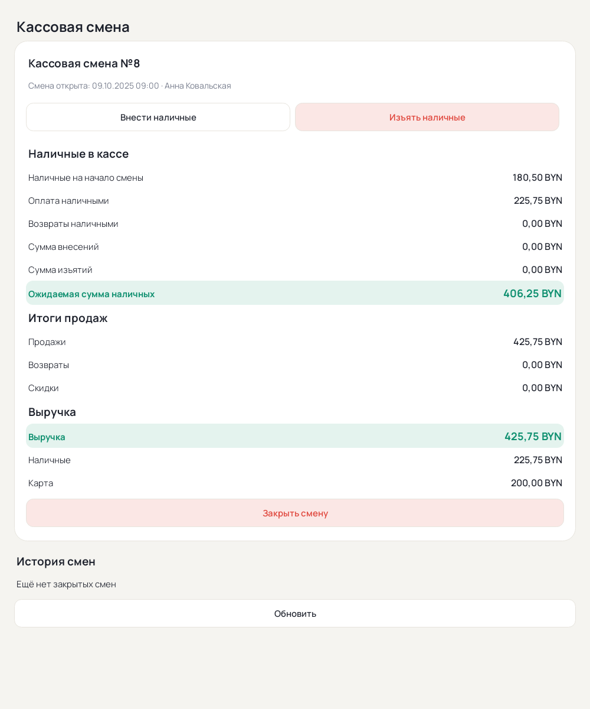
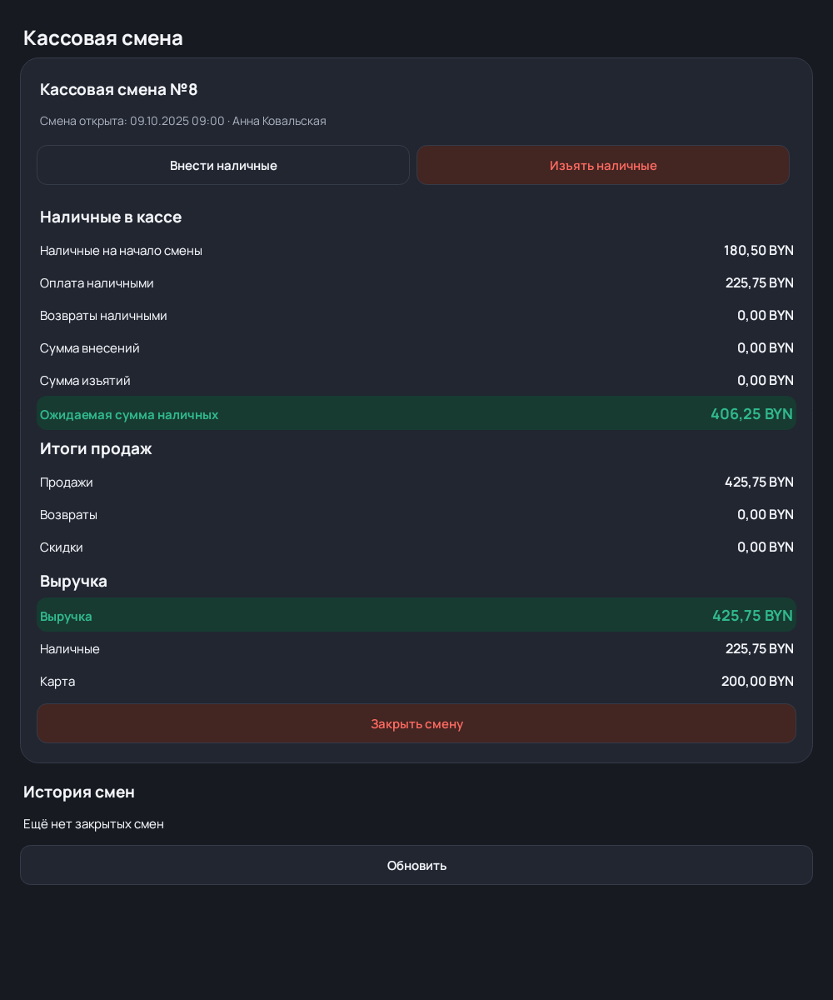

# Превью нативного стиля M POS — этап 071

Нативные Android Views отрисованы Robolectric с native graphics и синтетическими
данными. Это превью реализации, не скриншоты физического планшета. Изображения
генерирует MPosNativeThemeTest в app/build/design-previews; ручная проверка
landscape, клавиатуры и крупного шрифта ещё ожидается.

## Выбор сотрудника

## Кассовая смена

Style guide: ../../NATIVE_DESIGN_SYSTEM.md. Существующие суммы/права/сохранение
остаются на прежнем пути; изменено визуальное представление. Проверки этапа:
238 JS, 228 JVM, lint 0 errors/15 прежних warnings. APK локально не собиралась.
