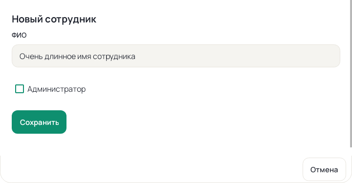
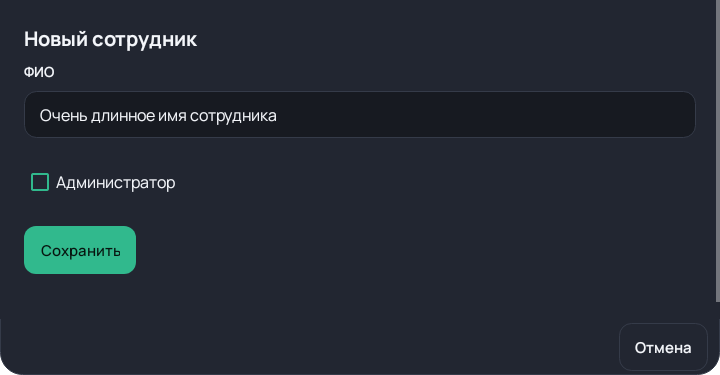

# Нативные формы настроек — этап 100

Синтетические превью настоящих Android Views, отрисованные Robolectric.
Это не скриншоты HONOR и не физическая приёмка. Форма использует общий
MPosNativeTheme и локальный Manrope; короткие формы занимают высоту содержимого,
длинные прокручиваются, действия переносятся при большом шрифте.

Проверка: MPosSettingsScreenControllerTest, включая pending/blocked,
переключение роли, очистку полей, старые токены и перенос действий.
Бизнес-данные превью полностью синтетические, проверка пароля остаётся
в исходном обработчике. Правила: [стиль M POS](../../NATIVE_DESIGN_SYSTEM.md).
