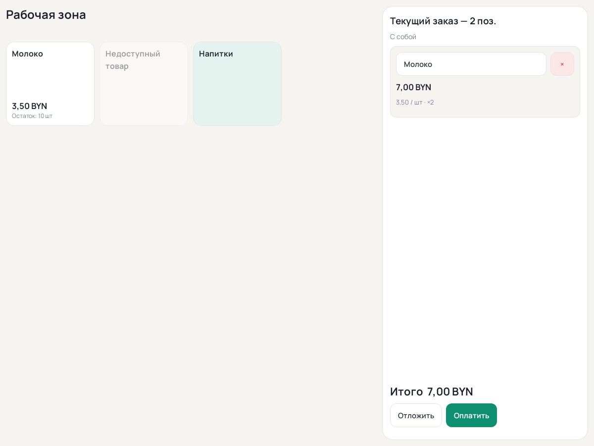
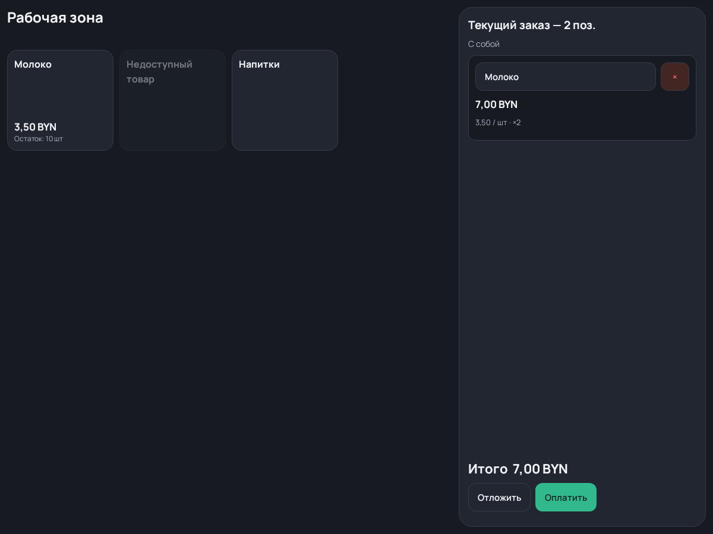

# Нативное рабочее место — этап 101

Синтетические превью Android Views, отрисованные Robolectric; это не скриншоты
HONOR и не физическая приёмка. Данные полностью синтетические.

Общий MPosNativeTheme и локальный Manrope, каталог/корзина на широком экране,
вертикальная прокручиваемая компоновка на узком, компактные действия и исходные
координаты плиток. Проверка: MPosWorkspaceControllerTest, включая выбор действий,
устаревшие результаты, блокировку, идентификатор строки удаления, геометрию
сетки, свайп и портретную компоновку.

Редактирование раскладки и модальные формы сохраняют reviewed presentation;
нормальный нативный режим скрывается на время этих границ. Расчёты/владельцы
данных не меняются. [Спецификация](../../../specs/101-native-workspace/spec.md).
Проверки шрифта/клавиатуры/жестов на устройстве остаются в общей приёмке.
