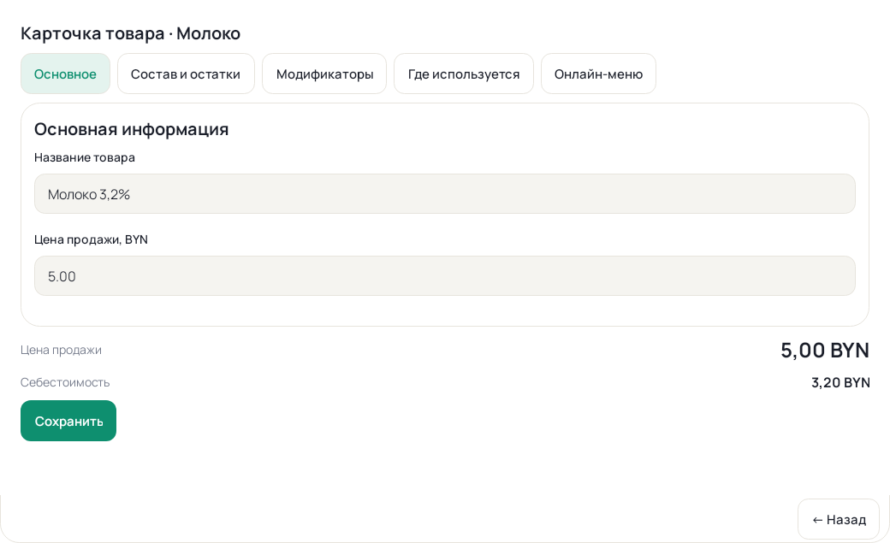
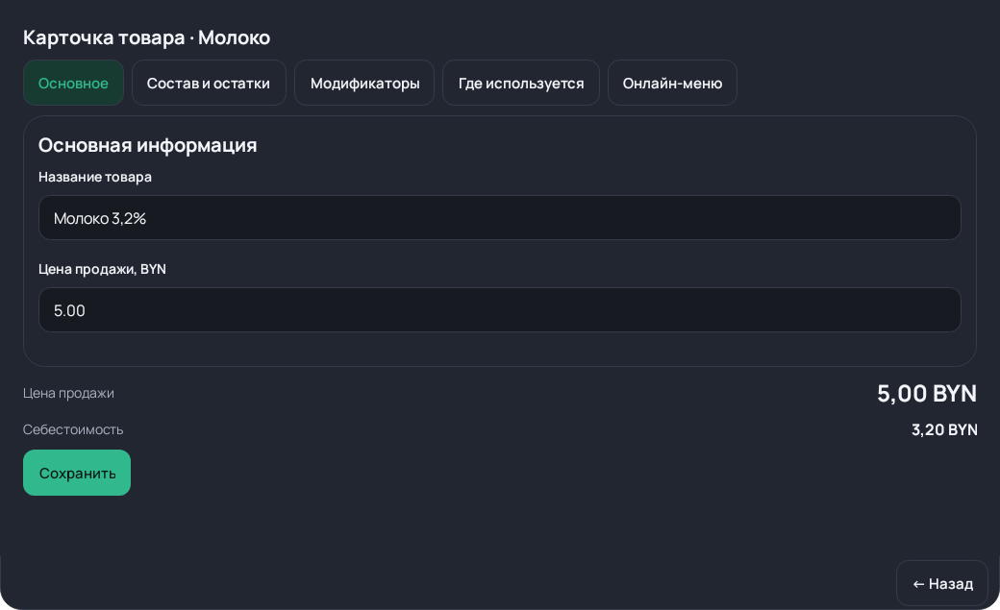

# 102 — нативная карточка товара

Синтетические Android View previews с тестовыми товарами, не скриншоты HONOR
и не подтверждение физической приёмки. Используются общий Manrope/палитры,
мягкое выделение активного раздела, карточки полей и сводка с суммами справа.
Реальный редактор также содержит исходные подразделы/поля/пикеры и сохранение
в верхней части; эти превью показывают укороченный тестовый набор данных.

| Светлая тема | Тёмная тема |
|---|---|
|  |  |

Динамика полей/фокуса/курсора, async saving lock, промежуточные дробные числа,
unsent cancel и очистка удалённых полей покрыты native view tests. Полные
физические проверки клавиатуры, landscape, шрифта 150–200%, фото и бизнес-
сценариев находятся в NATIVE_TABLET_ACCEPTANCE.md, раздел 102, pending.
