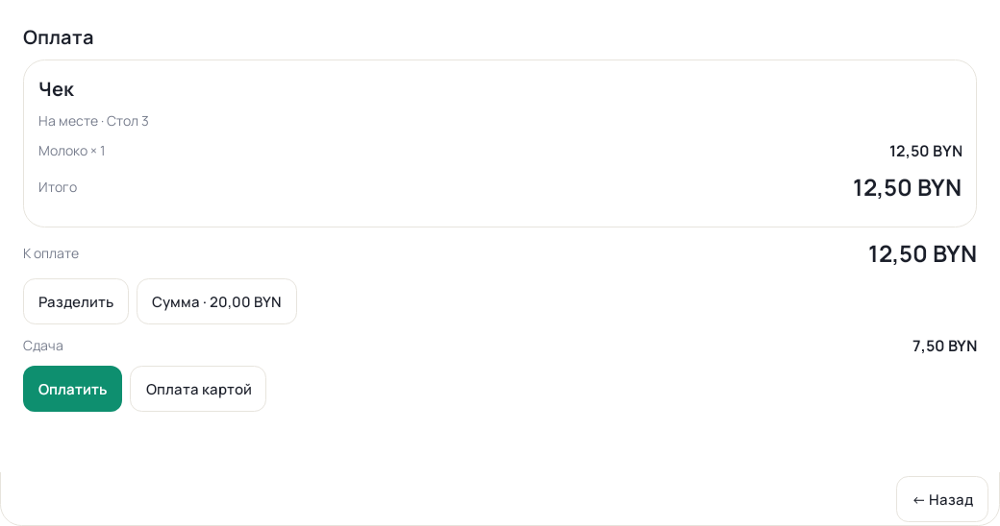
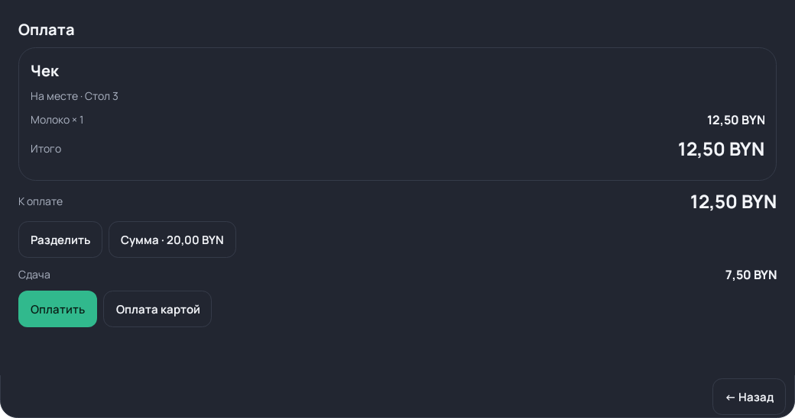

# 103 — нативная оплата

Синтетические Android View previews с тестовым чеком. Это не скриншоты HONOR
и не физическая приёмка. Общий Manrope/палитры, чек и форматированные суммы
справа, основной наличный платёж/вторичная карта, компактные действия.

| Светлая тема | Тёмная тема |
|---|---|
|  |  |

Actual reviewed renderer tests проверяют оплаты/confirmation/cancel/paid split/
commit-before-send/recovery/Done/offline reward Back. Native tests проверяют
hardware Back/отказ/блокировки и отсутствие второй видимой кнопки Done.
Физические проверки клавиатуры, font scale, long receipts, nested native cash/
split/count/amount, offline/restart/print описаны в NATIVE_TABLET_ACCEPTANCE.md.
Source formatting/DOM runtime сохраняется до 109; измерения скорости/памяти 110.
